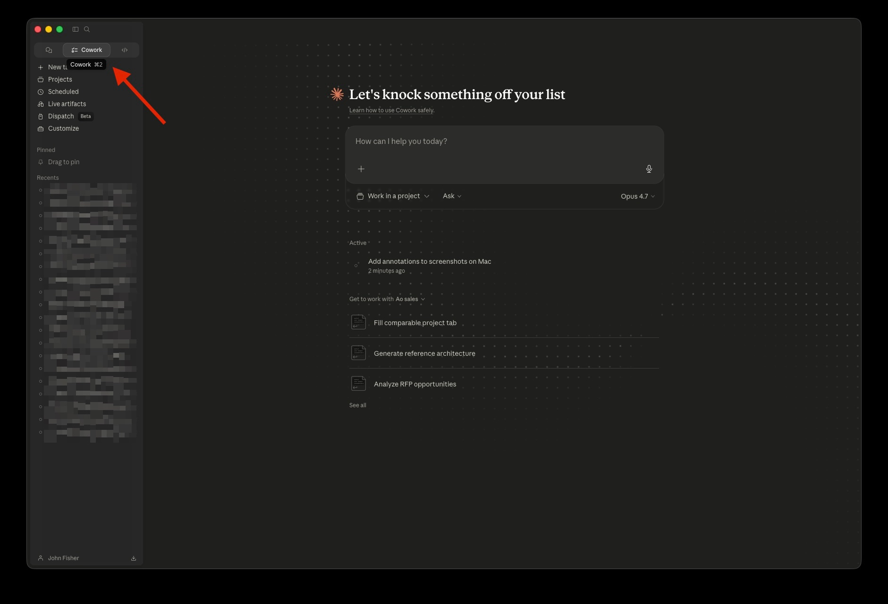
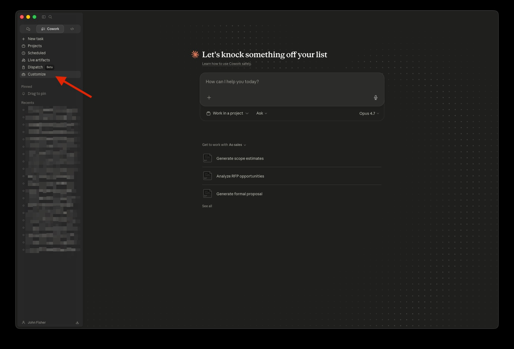
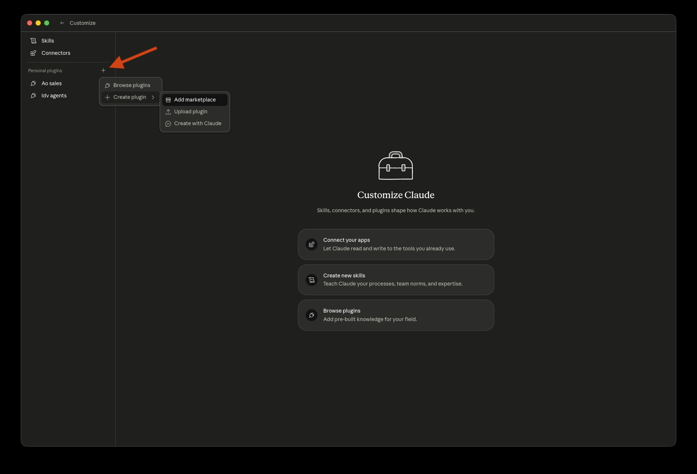
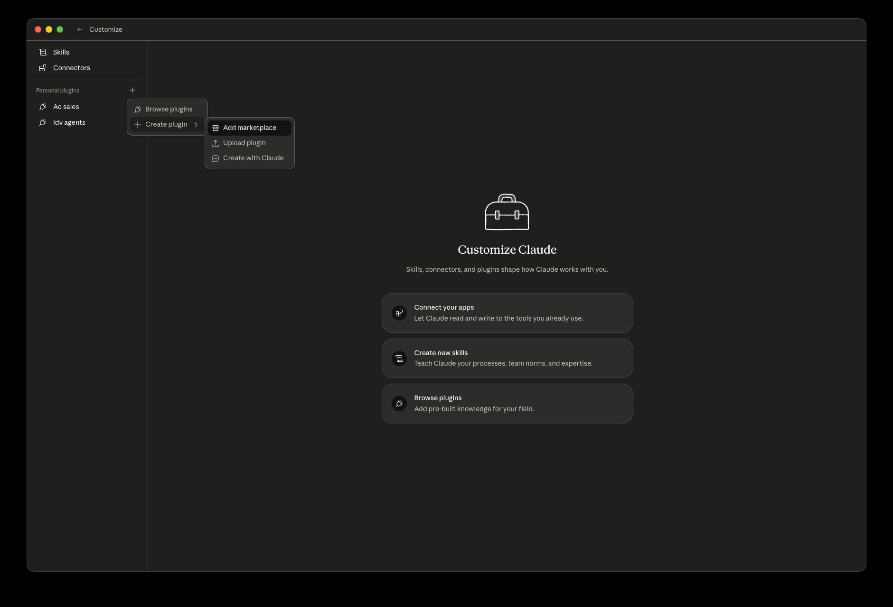
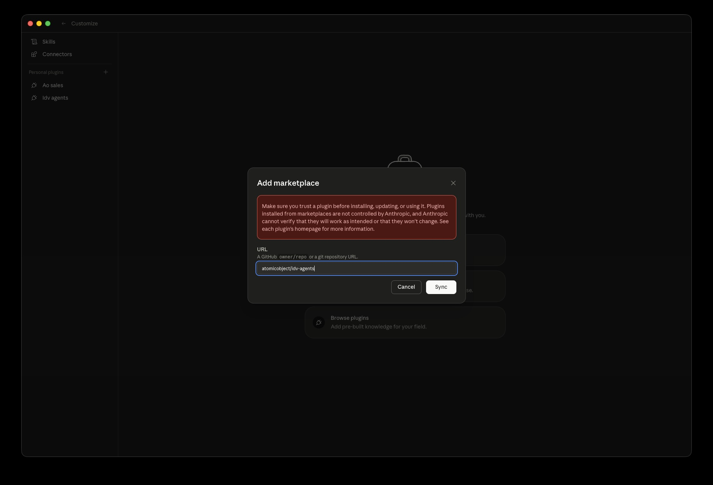
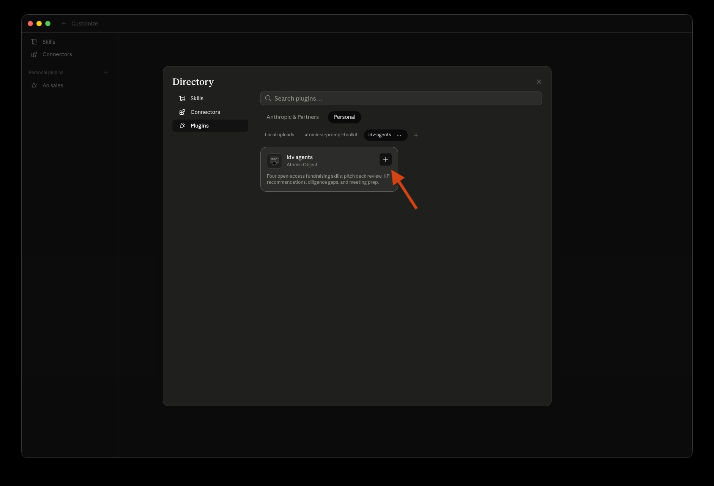
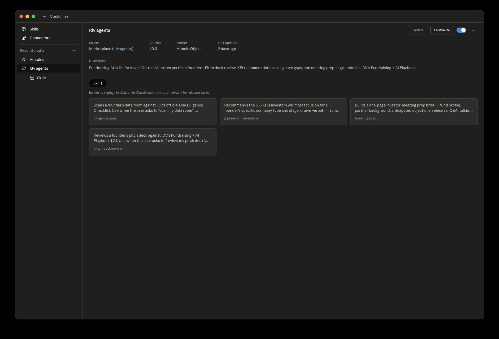

# idv-agents

Fundraising AI skills for Invest Detroit Ventures portfolio founders, built by Atomic Object. Drop your pitch deck in Claude Cowork and get IDV-grade feedback in minutes.

> **Status**: v1.2.1 — ready for the IDV Portfolio Summit, May 13, 2026.

## What's in here

Four skills, each available as both a slash command and an auto-trigger:

| Skill | Slash command | What it does |
|---|---|---|
| **Pitch deck review** | `/pitch-deck-review` | Scores your deck 1–5 across the 10 dimensions in the IDV Fundraising + AI Playbook §2.1, surfaces red flags from the playbook's Deck Pitfalls box verbatim, and gives an overall readiness rating tied to §1.2. |
| **KPI recommendations** | `/kpi-recommendations` | Recommends the 5–8 KPIs investors will actually focus on for your company type and stage — verbatim from playbook §1.3 with definition, why-it-matters, how-to-calculate, and healthy range. Flags vanity-metric anti-patterns and previews the next-stage KPI shift. |
| **Diligence gaps** | `/diligence-gaps` | Scans your data room against IDV's official Due Diligence Checklist across all four sections (Business Overview / Financials / Fundraising / Corporate and Legal Docs), severity-tags each gap ([BLOCKER] / [TYPICAL FOR STAGE] / [NICE TO HAVE]), and catches cross-document numerical inconsistencies when contents are provided. |
| **Meeting prep** | `/meeting-prep` | Builds a structured-workflow prep brief per playbook §6.1 — fund basics, partner background, recent investments, anticipated objections, and 5–8 likely questions — plus a talking-points scaffold the founder fills in. Workflow, not autonomous agent (per playbook §6.4). |

## Install

### Prerequisites

- **Claude desktop app installed**, with the **Cowork** tab available. Get it from [claude.ai](https://claude.ai) if you don't have it.
- **A paid Claude account.** This plugin runs on your Claude tokens, not IDV's.

You'll also want a pitch deck, KPI dashboard, data room snapshot, or target investor in mind — depending on which skill you're running.

### Install (Cowork UI — recommended, ~1 minute)

1. Open the Claude desktop app and switch to the **Cowork** tab.
   
2. Click **Customize** in the left sidebar.
   
3. Under **Personal plugins**, click the **+** (Add plugin) button.
   
4. Choose **Create plugin**, then **Add marketplace**.
   
5. In the **Add marketplace** modal, enter `atomicobject/idv-agents` and click **Sync**. (The repo is public on GitHub.)
   
6. The **Directory** modal opens automatically once Sync succeeds. In the left sidebar, select **Plugins** → the **Personal** tab → the **idv-agents** sub-tab.
   
7. Click the **+** next to **Idv agents** to install. You should see a confirmation that the plugin is installed.
   

### If the marketplace gives you trouble: install from a downloaded zip

The marketplace flow above is the fastest path, but we've seen it fail intermittently for some founders. If `Sync` errors, hangs, or the plugin won't install from the Directory, fall back to a manual zip install:

1. Download `idv-agents-1.2.1.zip` from the [latest release page](https://github.com/atomicobject/idv-agents/releases/latest).
2. Unzip it. You'll get a folder named `idv-agents/`.
3. In Cowork → **Customize** → **Personal plugins** → **+** → **Create plugin** → **Add marketplace**, and instead of typing `atomicobject/idv-agents`, paste the **full local path to the unzipped `idv-agents/` folder** (on Mac: drag the folder into Terminal to copy its path), then click **Sync**.
4. Continue from step 6 of the Cowork UI install above (the Directory modal opens; select **Plugins → Personal → idv-agents → Idv agents** and click **+**).

Your Cowork version may also offer an **upload a custom plugin file** option in the same Personal plugins menu — if so, you can use that instead of step 3 to upload the zip directly. See Anthropic's [Use plugins in Claude Cowork](https://support.claude.com/en/articles/13837440-use-plugins-in-claude-cowork) support article for the upload-file flow.

### Verify it worked

In any Cowork chat, type `/` and start typing `pitch` — you should see `/pitch-deck-review` in the autocomplete. The same goes for `/kpi-recommendations`, `/diligence-gaps`, and `/meeting-prep`.

For natural-language triggering: try saying *"Claude, can you review my pitch deck?"* — Claude should offer to use the `pitch-deck-review` skill.

### Alternative: Claude Code CLI

If you're using the Claude Code CLI rather than the desktop app's Cowork tab, install via slash commands instead:

```
/plugin marketplace add atomicobject/idv-agents
/plugin install idv-agents@idv-agents
```

Verify with `/plugin list` — you should see `idv-agents` in the active list. Same `/`-autocomplete check applies.

### Troubleshooting

**"Sync failed" or marketplace doesn't appear after entering `atomicobject/idv-agents`:**
- Double-check the spelling — it's `atomicobject/idv-agents` (no typo).
- Confirm you have network access; the Sync step pulls from GitHub.
- Make sure the Claude desktop app is updated to a recent version.
- If retries don't work, fall back to the [manual zip install](#if-the-marketplace-gives-you-trouble-install-from-a-downloaded-zip) above.

**Plugin installed but `/pitch-deck-review` etc. don't appear in `/` autocomplete:**
- Open a fresh Cowork chat — some plugin loads need a new session to register commands.
- Re-open the Customize panel and confirm **Idv agents** still shows as installed.

**WebFetch errors when running `/meeting-prep`:**
- The skill asks before fetching public sources. If a fetch fails (paywall, login wall, JS-heavy site), the skill falls back to "FOUNDER TO RESEARCH" markers. That's expected — paste the content yourself or skip that section.

**For general Cowork-plugin issues outside the IDV-specific install:** see Anthropic's [Use plugins in Claude Cowork](https://support.claude.com/en/articles/13837440-use-plugins-in-claude-cowork) support article.

**Still stuck:** during the May 13 workshop, flag down anyone with an Atomic Object name tag. Outside of that, file an issue at [github.com/atomicobject/idv-agents/issues](https://github.com/atomicobject/idv-agents/issues).

### Uninstalling

In Cowork → **Customize** → **Personal plugins**, find **Idv agents** and uninstall it from the Directory. To also remove the marketplace, remove the **idv-agents** entry from the same Directory view.

If you installed via the Claude Code CLI instead:

```
/plugin uninstall idv-agents
/plugin marketplace remove idv-agents
```

## Source of truth

Skills cite the **IDV Fundraising + AI Playbook (Portfolio Summit 2026)** verbatim where applicable, with page numbers. Output is grounded in IDV-curated criteria, not generic LLM advice.

## Attribution & License

Built by [Atomic Object](https://atomicobject.com) for [Invest Detroit Ventures](https://idventures.com).

Licensed under MIT — fork it, modify it, ship it. If you build something useful on top, we'd love to hear about it (john.fisher@atomicobject.com).

## Workshop attendees

If you're at the Portfolio Summit on May 13, 2026: install ahead of the session per the [Install](#install) section. We'll do the rest live.
